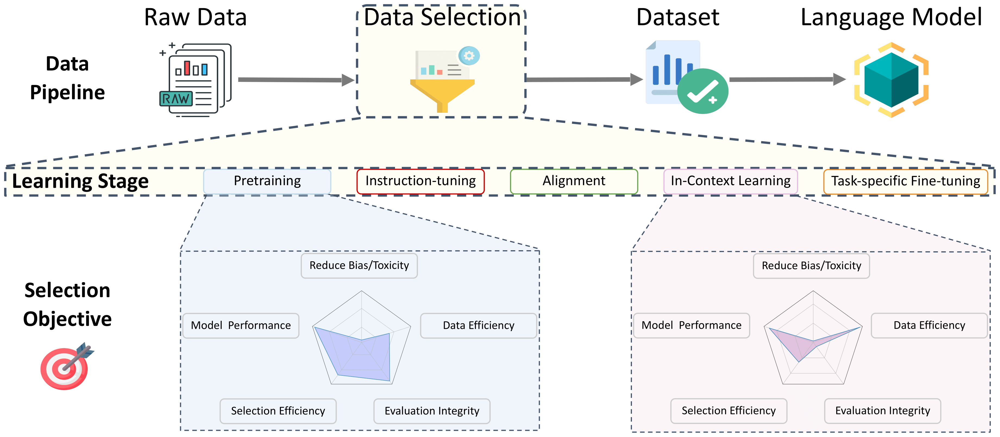
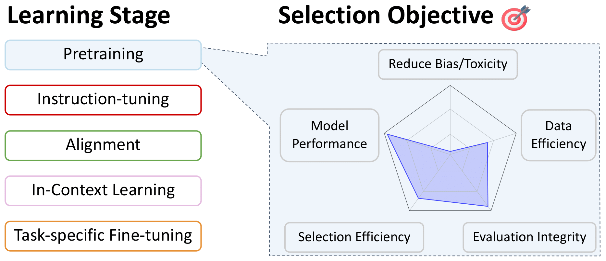
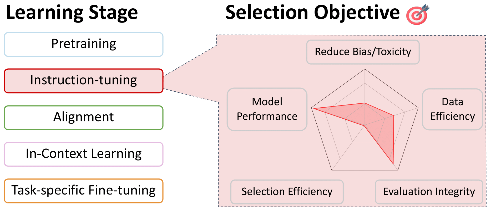
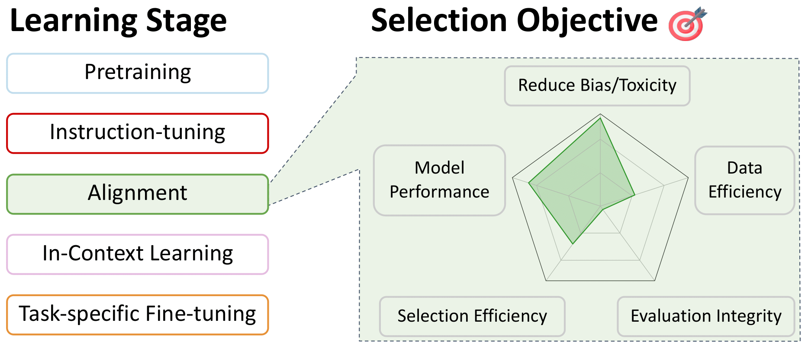
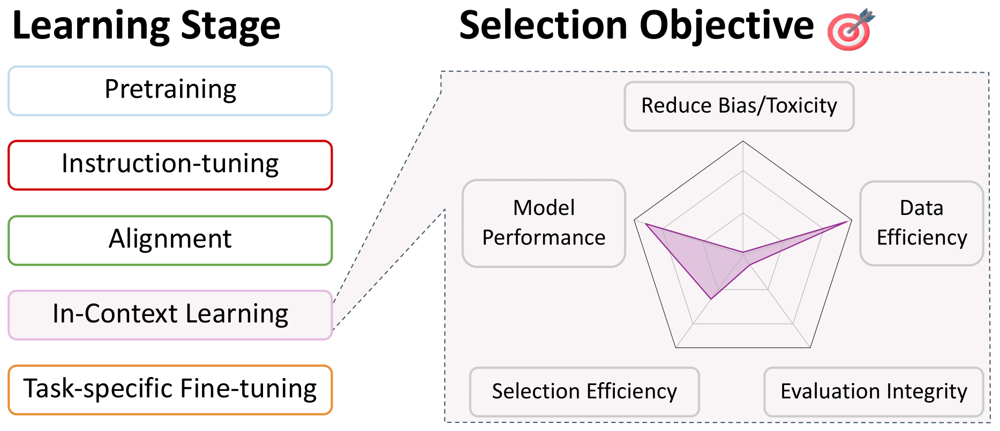
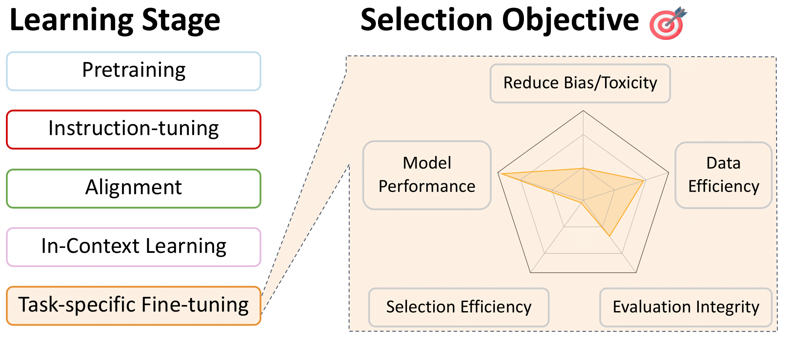

# A Survey on Data Selection for Language Models

This repo is a convenient listing of papers relevant to data selection for language models, during all stages of training. This is meant to be a resource for the community, so please [contribute](#contribution) if you see anything missing!

For more detail on these works, and more, see our survey paper: [A Survey on Data Selection for Language Models](https://arxiv.org/abs/2402.16827).
By this incredible team: Alon Albalak, Yanai Elazar, Sang Michael Xie, Shayne Longpre, Nathan Lambert, Xinyi Wang, Niklas Muennighoff, Bairu Hou, Liangming Pan, Haewon Jeong, Colin Raffel, Shiyu Chang, Tatsunori Hashimoto, William Yang Wang

# Table of Contents

- [Data Selection for Pretraining](#data-selection-for-pretraining)
  - [Language Filtering](#language-filtering)
  - [Heuristic Approaches](#heuristic-approaches)
  - [Data Quality](#data-quality)
  - [Domain-Specific Selection](#domain-specific-selection)
  - [Data Deduplication](#data-deduplication)
  - [Filtering Toxic and Explicit Content](#filtering-toxic-and-explicit-content)
  - [Specialized Selection for Multilingual Models](#specialized-selection-for-multilingual-models)
  - [Data Mixing](#data-mixing)
- [Data Selection for Instruction-Tuning and Multitask Training](#data-selection-for-instruction-tuning-and-multitask-training)
- [Data Selection for Preference Fine-tuning Alignment](#data-selection-for-preference-fine-tuning-alignment)
- [Data Selection for In-Context Learning](#data-selection-for-in-context-learning)
- [Data Selection for Task-specific Fine-tuning](#data-selection-for-task-specific-fine-tuning)

# Data Selection for Pretraining

## Language Filtering

[Back to Table of Contents](#table-of-contents)

- [FastText.zip: Compressing text classification models](https://arxiv.org/abs/1612.03651): 2016 &emsp;Armand Joulin and Edouard Grave and Piotr Bojanowski and Matthijs Douze and Hérve Jégou and Tomas Mikolov 
- [Learning Word Vectors for 157 Languages](https://aclanthology.org/L18-1550): 2018 &emsp;Grave, Edouard and Bojanowski, Piotr and Gupta, Prakhar and Joulin, Armand and Mikolov, Tomas 
- [Cross-lingual Language Model Pretraining](https://proceedings.neurips.cc/paper_files/paper/2019/file/c04c19c2c2474dbf5f7ac4372c5b9af1-Paper.pdf): 2019 &emsp;Conneau, Alexis and Lample, Guillaume 
- [Exploring the Limits of Transfer Learning with a Unified Text-to-Text Transformer](https://jmlr.org/papers/volume21/20-074/20-074.pdf): 2020 &emsp;Raffel, Colin and Shazeer, Noam and Roberts, Adam... 3 hidden ... Zhou, Yanqi and Li, Wei and Liu, Peter J. 
- [Language ID in the wild: Unexpected challenges on the path to a thousand-language web text corpus](https://arxiv.org/abs/2010.14571): 2020 &emsp;Caswell, Isaac and Breiner, Theresa and van Esch, Daan and Bapna, Ankur 
- [Unsupervised Cross-lingual Representation Learning at Scale](https://aclanthology.org/2020.acl-main.747): 2020 &emsp;Conneau, Alexis and Khandelwal, Kartikay and Goyal, Naman... 4 hidden ... Ott, Myle and Zettlemoyer, Luke and Stoyanov, Veselin 
- [CCNet: Extracting High Quality Monolingual Datasets from Web Crawl Data](https://aclanthology.org/2020.lrec-1.494): 2020 &emsp;Wenzek, Guillaume and Lachaux, Marie-Anne and Conneau, Alexis... 1 hidden ... Guzm'an, Francisco and Joulin, Armand and Grave, Edouard 
- [A reproduction of Apple's bi-directional LSTM models for language identification in short strings](https://aclanthology.org/2021.eacl-srw.6): 2021 &emsp;Toftrup, Mads and Asger Sorensen, Soren and Ciosici, Manuel R. and Assent, Ira 
- [Evaluating Large Language Models Trained on Code](https://arxiv.org/abs/2107.03374): 2021 &emsp;Mark Chen and Jerry Tworek and Heewoo Jun... 52 hidden ... Sam McCandlish and Ilya Sutskever and Wojciech Zaremba 
- [mT5: A Massively Multilingual Pre-trained Text-to-Text Transformer](https://aclanthology.org/2021.naacl-main.41): 2021 &emsp;Xue, Linting and Constant, Noah and Roberts, Adam... 2 hidden ... Siddhant, Aditya and Barua, Aditya and Raffel, Colin 
- [Competition-level code generation with AlphaCode](http://dx.doi.org/10.1126/science.abq1158): 2022 &emsp;Li, Yujia and Choi, David and Chung, Junyoung... 20 hidden ... de Freitas, Nando and Kavukcuoglu, Koray and Vinyals, Oriol 
- [PaLM: Scaling Language Modeling with Pathways](https://arxiv.org/abs/2204.02311): 2022 &emsp;Aakanksha Chowdhery and Sharan Narang and Jacob Devlin... 61 hidden ... Jeff Dean and Slav Petrov and Noah Fiedel 
- [The BigScience ROOTS Corpus: A 1.6TB Composite Multilingual Dataset](https://proceedings.neurips.cc/paper_files/paper/2022/file/ce9e92e3de2372a4b93353eb7f3dc0bd-Paper-Datasets_and_Benchmarks.pdf): 2022 &emsp;Laurenccon, Hugo and Saulnier, Lucile and Wang, Thomas... 48 hidden ... Mitchell, Margaret and Luccioni, Sasha Alexandra and Jernite, Yacine 
- [Writing System and Speaker Metadata for 2,800+ Language Varieties](https://aclanthology.org/2022.lrec-1.538): 2022 &emsp;van Esch, Daan and Lucassen, Tamar and Ruder, Sebastian and Caswell, Isaac and Rivera, Clara 
- [FinGPT: Large Generative Models for a Small Language](https://arxiv.org/abs/2311.05640): 2023 &emsp;Luukkonen, Risto and Komulainen, Ville and Luoma, Jouni... 5 hidden ... Muennighoff, Niklas and Piktus, Aleksandra and others 
- [MC^ 2: A Multilingual Corpus of Minority Languages in China](https://arxiv.org/abs/2311.08348): 2023 &emsp;Zhang, Chen and Tao, Mingxu and Huang, Quzhe and Lin, Jiuheng and Chen, Zhibin and Feng, Yansong 
- [Madlad-400: A multilingual and document-level large audited dataset](https://arxiv.org/abs/2309.04662): 2023 &emsp;Kudugunta, Sneha and Caswell, Isaac and Zhang, Biao... 5 hidden ... Stella, Romi and Bapna, Ankur and others 
- [The RefinedWeb Dataset for Falcon LLM: Outperforming Curated Corpora with Web Data, and Web Data Only](https://arxiv.org/abs/2306.01116): 2023 &emsp;Guilherme Penedo and Quentin Malartic and Daniel Hesslow... 3 hidden ... Baptiste Pannier and Ebtesam Almazrouei and Julien Launay 
- [Dolma: an Open Corpus of Three Trillion Tokens for Language Model Pretraining Research](https://arxiv.org/abs/2402.00159): 2024 &emsp;Luca Soldaini and Rodney Kinney and Akshita Bhagia... 30 hidden ... Dirk Groeneveld and Jesse Dodge and Kyle Lo 

## Heuristic Approaches

[Back to Table of Contents](#table-of-contents)

- [Exploring the Limits of Transfer Learning with a Unified Text-to-Text Transformer](https://jmlr.org/papers/volume21/20-074/20-074.pdf): 2020 &emsp;Raffel, Colin and Shazeer, Noam and Roberts, Adam... 3 hidden ... Zhou, Yanqi and Li, Wei and Liu, Peter J. 
- [Language Models are Few-Shot Learners](https://proceedings.neurips.cc/paper_files/paper/2020/file/1457c0d6bfcb4967418bfb8ac142f64a-Paper.pdf): 2020 &emsp;Brown, Tom and Mann, Benjamin and Ryder, Nick... 25 hidden ... Radford, Alec and Sutskever, Ilya and Amodei, Dario 
- [The Pile: An 800GB Dataset of Diverse Text for Language Modeling](https://arxiv.org/abs/2101.00027): 2020 &emsp;Leo Gao and Stella Biderman and Sid Black... 6 hidden ... Noa Nabeshima and Shawn Presser and Connor Leahy 
- [Evaluating Large Language Models Trained on Code](https://arxiv.org/abs/2107.03374): 2021 &emsp;Mark Chen and Jerry Tworek and Heewoo Jun... 52 hidden ... Sam McCandlish and Ilya Sutskever and Wojciech Zaremba 
- [mT5: A Massively Multilingual Pre-trained Text-to-Text Transformer](https://aclanthology.org/2021.naacl-main.41): 2021 &emsp;Xue, Linting and Constant, Noah and Roberts, Adam... 2 hidden ... Siddhant, Aditya and Barua, Aditya and Raffel, Colin 
- [Scaling Language Models: Methods, Analysis & Insights from Training Gopher](https://arxiv.org/abs/2112.11446): 2022 &emsp;Jack W. Rae and Sebastian Borgeaud and Trevor Cai... 74 hidden ... Demis Hassabis and Koray Kavukcuoglu and Geoffrey Irving 
- [The BigScience ROOTS Corpus: A 1.6TB Composite Multilingual Dataset](https://proceedings.neurips.cc/paper_files/paper/2022/file/ce9e92e3de2372a4b93353eb7f3dc0bd-Paper-Datasets_and_Benchmarks.pdf): 2022 &emsp;Laurenccon, Hugo and Saulnier, Lucile and Wang, Thomas... 48 hidden ... Mitchell, Margaret and Luccioni, Sasha Alexandra and Jernite, Yacine 
- [HTLM: Hyper-Text Pre-Training and Prompting of Language Models](https://openreview.net/forum?id=P-pPW1nxf1r): 2022 &emsp;Armen Aghajanyan and Dmytro Okhonko and Mike Lewis... 1 hidden ... Hu Xu and Gargi Ghosh and Luke Zettlemoyer 
- [LLaMA: Open and Efficient Foundation Language Models](https://arxiv.org/abs/2302.13971): 2023 &emsp;Hugo Touvron and Thibaut Lavril and Gautier Izacard... 8 hidden ... Armand Joulin and Edouard Grave and Guillaume Lample 
- [The RefinedWeb Dataset for Falcon LLM: Outperforming Curated Corpora with Web Data, and Web Data Only](https://arxiv.org/abs/2306.01116): 2023 &emsp;Guilherme Penedo and Quentin Malartic and Daniel Hesslow... 3 hidden ... Baptiste Pannier and Ebtesam Almazrouei and Julien Launay 
- [The foundation model transparency index](https://arxiv.org/abs/2310.12941): 2023 &emsp;Bommasani, Rishi and Klyman, Kevin and Longpre, Shayne... 2 hidden ... Xiong, Betty and Zhang, Daniel and Liang, Percy 
- [Dolma: an Open Corpus of Three Trillion Tokens for Language Model Pretraining Research](https://arxiv.org/abs/2402.00159): 2024 &emsp;Luca Soldaini and Rodney Kinney and Akshita Bhagia... 30 hidden ... Dirk Groeneveld and Jesse Dodge and Kyle Lo 

## Data Quality

[Back to Table of Contents](#table-of-contents)

- [KenLM: Faster and Smaller Language Model Queries](https://aclanthology.org/W11-2123): 2011 &emsp;Heafield, Kenneth 
- [FastText.zip: Compressing text classification models](https://arxiv.org/abs/1612.03651): 2016 &emsp;Armand Joulin and Edouard Grave and Piotr Bojanowski and Matthijs Douze and Hérve Jégou and Tomas Mikolov 
- [Learning Word Vectors for 157 Languages](https://aclanthology.org/L18-1550): 2018 &emsp;Grave, Edouard and Bojanowski, Piotr and Gupta, Prakhar and Joulin, Armand and Mikolov, Tomas 
- [Language Models are Unsupervised Multitask Learners](https://api.semanticscholar.org/CorpusID:160025533): 2019 &emsp;Alec Radford and Jeff Wu and Rewon Child and David Luan and Dario Amodei and Ilya Sutskever 
- [Language Models are Few-Shot Learners](https://proceedings.neurips.cc/paper_files/paper/2020/file/1457c0d6bfcb4967418bfb8ac142f64a-Paper.pdf): 2020 &emsp;Brown, Tom and Mann, Benjamin and Ryder, Nick... 25 hidden ... Radford, Alec and Sutskever, Ilya and Amodei, Dario 
- [The Pile: An 800GB Dataset of Diverse Text for Language Modeling](https://arxiv.org/abs/2101.00027): 2020 &emsp;Leo Gao and Stella Biderman and Sid Black... 6 hidden ... Noa Nabeshima and Shawn Presser and Connor Leahy 
- [CCNet: Extracting High Quality Monolingual Datasets from Web Crawl Data](https://aclanthology.org/2020.lrec-1.494): 2020 &emsp;Wenzek, Guillaume and Lachaux, Marie-Anne and Conneau, Alexis... 1 hidden ... Guzm'an, Francisco and Joulin, Armand and Grave, Edouard 
- [Detoxifying language models risks marginalizing minority voices](https://arxiv.org/abs/2104.06390): 2021 &emsp;Xu, Albert and Pathak, Eshaan and Wallace, Eric and Gururangan, Suchin and Sap, Maarten and Klein, Dan 
- [PaLM: Scaling Language Modeling with Pathways](https://arxiv.org/abs/2204.02311): 2022 &emsp;Aakanksha Chowdhery and Sharan Narang and Jacob Devlin... 61 hidden ... Jeff Dean and Slav Petrov and Noah Fiedel 
- [Scaling Language Models: Methods, Analysis & Insights from Training Gopher](https://arxiv.org/abs/2112.11446): 2022 &emsp;Jack W. Rae and Sebastian Borgeaud and Trevor Cai... 74 hidden ... Demis Hassabis and Koray Kavukcuoglu and Geoffrey Irving 
- [Whose Language Counts as High Quality? Measuring Language Ideologies in Text Data Selection](https://aclanthology.org/2022.emnlp-main.165): 2022 &emsp;Gururangan, Suchin and Card, Dallas and Dreier, Sarah... 2 hidden ... Wang, Zeyu and Zettlemoyer, Luke and Smith, Noah A. 
- [GLaM: Efficient Scaling of Language Models with Mixture-of-Experts](https://proceedings.mlr.press/v162/du22c.html): 2022 &emsp;Du, Nan and Huang, Yanping and Dai, Andrew M... 21 hidden ... Wu, Yonghui and Chen, Zhifeng and Cui, Claire 
- [A Pretrainer's Guide to Training Data: Measuring the Effects of Data Age, Domain Coverage, Quality, & Toxicity](https://arxiv.org/abs/2305.13169): 2023 &emsp;Shayne Longpre and Gregory Yauney and Emily Reif... 5 hidden ... Kevin Robinson and David Mimno and Daphne Ippolito 
- [Data Selection for Language Models via Importance Resampling](https://openreview.net/forum?id=uPSQv0leAu): 2023 &emsp;Sang Michael Xie and Shibani Santurkar and Tengyu Ma and Percy Liang 
- [The RefinedWeb Dataset for Falcon LLM: Outperforming Curated Corpora with Web Data, and Web Data Only](https://arxiv.org/abs/2306.01116): 2023 &emsp;Guilherme Penedo and Quentin Malartic and Daniel Hesslow... 3 hidden ... Baptiste Pannier and Ebtesam Almazrouei and Julien Launay 
- [Dolma: an Open Corpus of Three Trillion Tokens for Language Model Pretraining Research](https://arxiv.org/abs/2402.00159): 2024 &emsp;Luca Soldaini and Rodney Kinney and Akshita Bhagia... 30 hidden ... Dirk Groeneveld and Jesse Dodge and Kyle Lo 

## Domain-Specific Selection

[Back to Table of Contents](#table-of-contents)

- [Text data acquisition for domain-specific language models](https://aclanthology.org/W06-1645): 2006 &emsp;Sethy, Abhinav and Georgiou, Panayiotis G. and Narayanan, Shrikanth 
- [Intelligent Selection of Language Model Training Data](https://aclanthology.org/P10-2041): 2010 &emsp;Moore, Robert C. and Lewis, William 
- [Cynical Selection of Language Model Training Data](https://arxiv.org/abs/1709.02279): 2017 &emsp;Amittai Axelrod 
- [Automatic Document Selection for Efficient Encoder Pretraining](https://aclanthology.org/2022.emnlp-main.647): 2022 &emsp;Feng, Yukun and Xia, Patrick and Van Durme, Benjamin and Sedoc, Jo~ao 
- [Data Selection for Language Models via Importance Resampling](https://openreview.net/forum?id=uPSQv0leAu): 2023 &emsp;Sang Michael Xie and Shibani Santurkar and Tengyu Ma and Percy Liang 
- [DsDm: Model-Aware Dataset Selection with Datamodels](https://arxiv.org/abs/2401.12926): 2024 &emsp;Logan Engstrom and Axel Feldmann and Aleksander Madry 

## Data Deduplication

[Back to Table of Contents](#table-of-contents)

- [Space/time trade-offs in hash coding with allowable errors](https://doi.org/10.1145/362686.362692): 1970 &emsp;Bloom, Burton H. 
- [Suffix Arrays: A New Method for On-Line String Searches]( 
            https://doi.org/10.1137/0222058
    ): 1993 &emsp;Manber, Udi and Myers, Gene 
- [On the resemblance and containment of documents](None): 1997 &emsp;Broder, A.Z. 
- [Similarity Estimation Techniques from Rounding Algorithms](https://doi.org/10.1145/509907.509965): 2002 &emsp;Charikar, Moses S. 
- [URL normalization for de-duplication of web pages](https://doi.org/10.1145/1645953.1646283): 2009 &emsp;Agarwal, Amit and Koppula, Hema Swetha and Leela, Krishna P.... 3 hidden ... Haty, Chittaranjan and Roy, Anirban and Sasturkar, Amit 
- [Asynchronous pipelines for processing huge corpora on medium to low resource infrastructures](http://nbn-resolving.de/urn:nbn:de:bsz:mh39-90215): 2019 &emsp;Pedro Javier Ortiz Su'arez and Beno^it Sagot and Laurent Romary 
- [Language Models are Few-Shot Learners](https://proceedings.neurips.cc/paper_files/paper/2020/file/1457c0d6bfcb4967418bfb8ac142f64a-Paper.pdf): 2020 &emsp;Brown, Tom and Mann, Benjamin and Ryder, Nick... 25 hidden ... Radford, Alec and Sutskever, Ilya and Amodei, Dario 
- [The Pile: An 800GB Dataset of Diverse Text for Language Modeling](https://arxiv.org/abs/2101.00027): 2020 &emsp;Leo Gao and Stella Biderman and Sid Black... 6 hidden ... Noa Nabeshima and Shawn Presser and Connor Leahy 
- [CCNet: Extracting High Quality Monolingual Datasets from Web Crawl Data](https://aclanthology.org/2020.lrec-1.494): 2020 &emsp;Wenzek, Guillaume and Lachaux, Marie-Anne and Conneau, Alexis... 1 hidden ... Guzm'an, Francisco and Joulin, Armand and Grave, Edouard 
- [Beyond neural scaling laws: beating power law scaling via data pruning](https://openreview.net/forum?id=UmvSlP-PyV): 2022 &emsp;Ben Sorscher and Robert Geirhos and Shashank Shekhar and Surya Ganguli and Ari S. Morcos 
- [Deduplicating Training Data Makes Language Models Better](https://aclanthology.org/2022.acl-long.577): 2022 &emsp;Lee, Katherine and Ippolito, Daphne and Nystrom, Andrew... 1 hidden ... Eck, Douglas and Callison-Burch, Chris and Carlini, Nicholas 
- [MTEB: Massive text embedding benchmark](https://arxiv.org/abs/2210.07316): 2022 &emsp;Muennighoff, Niklas and Tazi, Nouamane and Magne, Lo"ic and Reimers, Nils 
- [PaLM: Scaling Language Modeling with Pathways](https://arxiv.org/abs/2204.02311): 2022 &emsp;Aakanksha Chowdhery and Sharan Narang and Jacob Devlin... 61 hidden ... Jeff Dean and Slav Petrov and Noah Fiedel 
- [Scaling Language Models: Methods, Analysis & Insights from Training Gopher](https://arxiv.org/abs/2112.11446): 2022 &emsp;Jack W. Rae and Sebastian Borgeaud and Trevor Cai... 74 hidden ... Demis Hassabis and Koray Kavukcuoglu and Geoffrey Irving 
- [Sgpt: Gpt sentence embeddings for semantic search](https://arxiv.org/abs/2202.08904): 2022 &emsp;Muennighoff, Niklas 
- [The BigScience ROOTS Corpus: A 1.6TB Composite Multilingual Dataset](https://proceedings.neurips.cc/paper_files/paper/2022/file/ce9e92e3de2372a4b93353eb7f3dc0bd-Paper-Datasets_and_Benchmarks.pdf): 2022 &emsp;Laurenccon, Hugo and Saulnier, Lucile and Wang, Thomas... 48 hidden ... Mitchell, Margaret and Luccioni, Sasha Alexandra and Jernite, Yacine 
- [C-pack: Packaged resources to advance general chinese embedding](https://arxiv.org/abs/2309.07597): 2023 &emsp;Xiao, Shitao and Liu, Zheng and Zhang, Peitian and Muennighoff, Niklas 
- [D4: Improving LLM Pretraining via Document De-Duplication and Diversification](https://arxiv.org/abs/2308.12284): 2023 &emsp;Kushal Tirumala and Daniel Simig and Armen Aghajanyan and Ari S. Morcos 
- [Large-scale Near-deduplication Behind BigCode](https://huggingface.co/blog/dedup): 2023 &emsp;Mou, Chenghao 
- [Paloma: A Benchmark for Evaluating Language Model Fit](https://arxiv.org/abs/2312.10523): 2023 &emsp;Ian Magnusson and Akshita Bhagia and Valentin Hofmann... 10 hidden ... Noah A. Smith and Kyle Richardson and Jesse Dodge 
- [Quantifying Memorization Across Neural Language Models](https://openreview.net/forum?id=TatRHT_1cK): 2023 &emsp;Nicholas Carlini and Daphne Ippolito and Matthew Jagielski and Katherine Lee and Florian Tramer and Chiyuan Zhang 
- [SemDeDup: Data-efficient learning at web-scale through semantic deduplication](https://arxiv.org/abs/2303.09540): 2023 &emsp;Abbas, Amro and Tirumala, Kushal and Simig, D'aniel and Ganguli, Surya and Morcos, Ari S 
- [The RefinedWeb Dataset for Falcon LLM: Outperforming Curated Corpora with Web Data, and Web Data Only](https://arxiv.org/abs/2306.01116): 2023 &emsp;Guilherme Penedo and Quentin Malartic and Daniel Hesslow... 3 hidden ... Baptiste Pannier and Ebtesam Almazrouei and Julien Launay 
- [What's In My Big Data?](https://arxiv.org/abs/2310.20707): 2023 &emsp;Elazar, Yanai and Bhagia, Akshita and Magnusson, Ian... 5 hidden ... Soldaini, Luca and Singh, Sameer and others 
- [Dolma: an Open Corpus of Three Trillion Tokens for Language Model Pretraining Research](https://arxiv.org/abs/2402.00159): 2024 &emsp;Luca Soldaini and Rodney Kinney and Akshita Bhagia... 30 hidden ... Dirk Groeneveld and Jesse Dodge and Kyle Lo 
- [Generative Representational Instruction Tuning](https://arxiv.org/abs/2402.09906): 2024 &emsp;Muennighoff, Niklas and Su, Hongjin and Wang, Liang... 2 hidden ... Yu, Tao and Singh, Amanpreet and Kiela, Douwe 

## Filtering Toxic and Explicit Content

[Back to Table of Contents](#table-of-contents)

- [Exploring the Limits of Transfer Learning with a Unified Text-to-Text Transformer](https://jmlr.org/papers/volume21/20-074/20-074.pdf): 2020 &emsp;Raffel, Colin and Shazeer, Noam and Roberts, Adam... 3 hidden ... Zhou, Yanqi and Li, Wei and Liu, Peter J. 
- [mT5: A Massively Multilingual Pre-trained Text-to-Text Transformer](https://aclanthology.org/2021.naacl-main.41): 2021 &emsp;Xue, Linting and Constant, Noah and Roberts, Adam... 2 hidden ... Siddhant, Aditya and Barua, Aditya and Raffel, Colin 
- [Perplexed by Quality: A Perplexity-based Method for Adult and Harmful Content Detection in Multilingual Heterogeneous Web Data](https://arxiv.org/abs/2212.10440): 2022 &emsp;Tim Jansen and Yangling Tong and Victoria Zevallos and Pedro Ortiz Suarez 
- [Scaling Language Models: Methods, Analysis & Insights from Training Gopher](https://arxiv.org/abs/2112.11446): 2022 &emsp;Jack W. Rae and Sebastian Borgeaud and Trevor Cai... 74 hidden ... Demis Hassabis and Koray Kavukcuoglu and Geoffrey Irving 
- [The BigScience ROOTS Corpus: A 1.6TB Composite Multilingual Dataset](https://proceedings.neurips.cc/paper_files/paper/2022/file/ce9e92e3de2372a4b93353eb7f3dc0bd-Paper-Datasets_and_Benchmarks.pdf): 2022 &emsp;Laurenccon, Hugo and Saulnier, Lucile and Wang, Thomas... 48 hidden ... Mitchell, Margaret and Luccioni, Sasha Alexandra and Jernite, Yacine 
- [Whose Language Counts as High Quality? Measuring Language Ideologies in Text Data Selection](https://aclanthology.org/2022.emnlp-main.165): 2022 &emsp;Gururangan, Suchin and Card, Dallas and Dreier, Sarah... 2 hidden ... Wang, Zeyu and Zettlemoyer, Luke and Smith, Noah A. 
- [A Pretrainer's Guide to Training Data: Measuring the Effects of Data Age, Domain Coverage, Quality, & Toxicity](https://arxiv.org/abs/2305.13169): 2023 &emsp;Shayne Longpre and Gregory Yauney and Emily Reif... 5 hidden ... Kevin Robinson and David Mimno and Daphne Ippolito 
- [AI image training dataset found to include child sexual abuse imagery](https://www.theverge.com/2023/12/20/24009418/generative-ai-image-laion-csam-google-stability-stanford): 2023 &emsp;David, Emilia 
- [Detecting Personal Information in Training Corpora: an Analysis](https://aclanthology.org/2023.trustnlp-1.18): 2023 &emsp;Subramani, Nishant and Luccioni, Sasha and Dodge, Jesse and Mitchell, Margaret 
- [GPT-4 Technical Report](https://arxiv.org/abs/2303.08774): 2023 &emsp;OpenAI and : and Josh Achiam... 276 hidden ... Juntang Zhuang and William Zhuk and Barret Zoph 
- [SantaCoder: don't reach for the stars!](https://arxiv.org/abs/2301.03988): 2023 &emsp;Allal, Loubna Ben and Li, Raymond and Kocetkov, Denis... 5 hidden ... Gu, Alex and Dey, Manan and others 
- [The RefinedWeb Dataset for Falcon LLM: Outperforming Curated Corpora with Web Data, and Web Data Only](https://arxiv.org/abs/2306.01116): 2023 &emsp;Guilherme Penedo and Quentin Malartic and Daniel Hesslow... 3 hidden ... Baptiste Pannier and Ebtesam Almazrouei and Julien Launay 
- [The foundation model transparency index](https://arxiv.org/abs/2310.12941): 2023 &emsp;Bommasani, Rishi and Klyman, Kevin and Longpre, Shayne... 2 hidden ... Xiong, Betty and Zhang, Daniel and Liang, Percy 
- [What's In My Big Data?](https://arxiv.org/abs/2310.20707): 2023 &emsp;Elazar, Yanai and Bhagia, Akshita and Magnusson, Ian... 5 hidden ... Soldaini, Luca and Singh, Sameer and others 
- [Dolma: an Open Corpus of Three Trillion Tokens for Language Model Pretraining Research](https://arxiv.org/abs/2402.00159): 2024 &emsp;Luca Soldaini and Rodney Kinney and Akshita Bhagia... 30 hidden ... Dirk Groeneveld and Jesse Dodge and Kyle Lo 
- [OLMo: Accelerating the Science of Language Models](https://arxiv.org/abs/2402.00838): 2024 &emsp;Groeneveld, Dirk and Beltagy, Iz and Walsh, Pete... 5 hidden ... Magnusson, Ian and Wang, Yizhong and others 

## Specialized Selection for Multilingual Models

[Back to Table of Contents](#table-of-contents)

- [Bloom: A 176b-parameter open-access multilingual language model](https://arxiv.org/abs/2211.05100): 2022 &emsp;Workshop, BigScience and Scao, Teven Le and Fan, Angela... 5 hidden ... Luccioni, Alexandra Sasha and Yvon, Franccois and others 
- [Quality at a Glance: An Audit of Web-Crawled Multilingual Datasets](https://aclanthology.org/2022.tacl-1.4): 2022 &emsp;Kreutzer, Julia and Caswell, Isaac and Wang, Lisa... 46 hidden ... Ahia, Oghenefego and Agrawal, Sweta and Adeyemi, Mofetoluwa 
- [The BigScience ROOTS Corpus: A 1.6TB Composite Multilingual Dataset](https://proceedings.neurips.cc/paper_files/paper/2022/file/ce9e92e3de2372a4b93353eb7f3dc0bd-Paper-Datasets_and_Benchmarks.pdf): 2022 &emsp;Laurenccon, Hugo and Saulnier, Lucile and Wang, Thomas... 48 hidden ... Mitchell, Margaret and Luccioni, Sasha Alexandra and Jernite, Yacine 
- [What language model to train if you have one million gpu hours?](https://arxiv.org/abs/2210.15424): 2022 &emsp;Scao, Teven Le and Wang, Thomas and Hesslow, Daniel... 5 hidden ... Muennighoff, Niklas and Phang, Jason and others 
- [Madlad-400: A multilingual and document-level large audited dataset](https://arxiv.org/abs/2309.04662): 2023 &emsp;Kudugunta, Sneha and Caswell, Isaac and Zhang, Biao... 5 hidden ... Stella, Romi and Bapna, Ankur and others 
- [Scaling multilingual language models under constrained data](None): 2023 &emsp;Scao, Teven Le 
- [Aya Dataset: An Open-Access Collection for Multilingual Instruction Tuning](https://arxiv.org/abs/2402.06619): 2024 &emsp;Shivalika Singh and Freddie Vargus and Daniel Dsouza... 27 hidden ... Ahmet Üstün and Marzieh Fadaee and Sara Hooker 

## Data Mixing

[Back to Table of Contents](#table-of-contents)

- [The Nonstochastic Multiarmed Bandit Problem](None): 2002 &emsp;Auer, Peter and Cesa-Bianchi, Nicol`o and Freund, Yoav and Schapire, Robert E. 
- [Distributionally Robust Language Modeling](https://aclanthology.org/D19-1432): 2019 &emsp;Oren, Yonatan and Sagawa, Shiori and Hashimoto, Tatsunori B. and Liang, Percy 
- [Distributionally Robust Neural Networks](https://openreview.net/forum?id=ryxGuJrFvS): 2020 &emsp;Shiori Sagawa and Pang Wei Koh and Tatsunori B. Hashimoto and Percy Liang 
- [Exploring the Limits of Transfer Learning with a Unified Text-to-Text Transformer](https://jmlr.org/papers/volume21/20-074/20-074.pdf): 2020 &emsp;Raffel, Colin and Shazeer, Noam and Roberts, Adam... 3 hidden ... Zhou, Yanqi and Li, Wei and Liu, Peter J. 
- [The Pile: An 800GB Dataset of Diverse Text for Language Modeling](https://arxiv.org/abs/2101.00027): 2020 &emsp;Leo Gao and Stella Biderman and Sid Black... 6 hidden ... Noa Nabeshima and Shawn Presser and Connor Leahy 
- [Scaling Language Models: Methods, Analysis & Insights from Training Gopher](https://arxiv.org/abs/2112.11446): 2022 &emsp;Jack W. Rae and Sebastian Borgeaud and Trevor Cai... 74 hidden ... Demis Hassabis and Koray Kavukcuoglu and Geoffrey Irving 
- [GLaM: Efficient Scaling of Language Models with Mixture-of-Experts](https://proceedings.mlr.press/v162/du22c.html): 2022 &emsp;Du, Nan and Huang, Yanping and Dai, Andrew M... 21 hidden ... Wu, Yonghui and Chen, Zhifeng and Cui, Claire 
- [Cross-Lingual Supervision improves Large Language Models Pre-training](https://arxiv.org/abs/2305.11778): 2023 &emsp;Andrea Schioppa and Xavier Garcia and Orhan Firat 
- [DoGE: Domain Reweighting with Generalization Estimation](https://arxiv.org/abs/arXiv preprint): 2023 &emsp;Simin Fan and Matteo Pagliardini and Martin Jaggi 
- [DoReMi: Optimizing Data Mixtures Speeds Up Language Model Pretraining](https://openreview.net/forum?id=lXuByUeHhd): 2023 &emsp;Sang Michael Xie and Hieu Pham and Xuanyi Dong... 4 hidden ... Quoc V Le and Tengyu Ma and Adams Wei Yu 
- [Efficient Online Data Mixing For Language Model Pre-Training](https://arxiv.org/abs/2312.02406): 2023 &emsp;Alon Albalak and Liangming Pan and Colin Raffel and William Yang Wang 
- [LLaMA: Open and Efficient Foundation Language Models](https://arxiv.org/abs/2302.13971): 2023 &emsp;Hugo Touvron and Thibaut Lavril and Gautier Izacard... 8 hidden ... Armand Joulin and Edouard Grave and Guillaume Lample 
- [Pythia: A Suite for Analyzing Large Language Models Across Training and Scaling](https://proceedings.mlr.press/v202/biderman23a.html): 2023 &emsp;Biderman, Stella and Schoelkopf, Hailey and Anthony, Quentin Gregory... 7 hidden ... Skowron, Aviya and Sutawika, Lintang and Van Der Wal, Oskar 
- [Scaling Data-Constrained Language Models](https://openreview.net/forum?id=j5BuTrEj35): 2023 &emsp;Niklas Muennighoff and Alexander M Rush and Boaz Barak... 3 hidden ... Sampo Pyysalo and Thomas Wolf and Colin Raffel 
- [Sheared LLaMA: Accelerating Language Model Pre-training via Structured Pruning](https://arxiv.org/abs/2310.06694): 2023 &emsp;Mengzhou Xia and Tianyu Gao and Zhiyuan Zeng and Danqi Chen 
- [Skill-it! A Data-Driven Skills Framework for Understanding and Training Language Models](https://arxiv.org/abs/2307.14430): 2023 &emsp;Mayee F. Chen and Nicholas Roberts and Kush Bhatia... 1 hidden ... Ce Zhang and Frederic Sala and Christopher Ré 

# Data Selection for Instruction-Tuning and Multitask Training

[Back to Table of Contents](#table-of-contents)

- [The natural language decathlon: Multitask learning as question answering](https://arxiv.org/abs/1806.08730): 2018 &emsp;McCann, Bryan and Keskar, Nitish Shirish and Xiong, Caiming and Socher, Richard 
- [Unifying question answering, text classification, and regression via span extraction](https://arxiv.org/abs/1904.09286): 2019 &emsp;Keskar, Nitish Shirish and McCann, Bryan and Xiong, Caiming and Socher, Richard 
- [Multi-Task Deep Neural Networks for Natural Language Understanding](https://aclanthology.org/P19-1441): 2019 &emsp;Liu, Xiaodong and He, Pengcheng and Chen, Weizhu and Gao, Jianfeng 
- [UnifiedQA: Crossing Format Boundaries with a Single QA System](https://aclanthology.org/2020.findings-emnlp.171): 2020 &emsp;Khashabi, Daniel and Min, Sewon and Khot, Tushar... 1 hidden ... Tafjord, Oyvind and Clark, Peter and Hajishirzi, Hannaneh 
- [Exploring the Limits of Transfer Learning with a Unified Text-to-Text Transformer](https://jmlr.org/papers/volume21/20-074/20-074.pdf): 2020 &emsp;Raffel, Colin and Shazeer, Noam and Roberts, Adam... 3 hidden ... Zhou, Yanqi and Li, Wei and Liu, Peter J. 
- [Muppet: Massive Multi-task Representations with Pre-Finetuning](https://aclanthology.org/2021.emnlp-main.468): 2021 &emsp;Aghajanyan, Armen and Gupta, Anchit and Shrivastava, Akshat and Chen, Xilun and Zettlemoyer, Luke and Gupta, Sonal 
- [Finetuned language models are zero-shot learners](https://openreview.net/forum?id=gEZrGCozdqR): 2021 &emsp;Wei, Jason and Bosma, Maarten and Zhao, Vincent Y.... 3 hidden ... Du, Nan and Dai, Andrew M. and Le, Quoc V. 
- [Cross-task generalization via natural language crowdsourcing instructions](https://arxiv.org/abs/2104.08773): 2021 &emsp;Mishra, Swaroop and Khashabi, Daniel and Baral, Chitta and Hajishirzi, Hannaneh 
- [Nl-augmenter: A framework for task-sensitive natural language augmentation](https://arxiv.org/abs/2112.02721): 2021 &emsp;Dhole, Kaustubh D and Gangal, Varun and Gehrmann, Sebastian... 5 hidden ... Shrivastava, Ashish and Tan, Samson and others 
- [Ext5: Towards extreme multi-task scaling for transfer learning](https://arxiv.org/abs/2111.10952): 2021 &emsp;Aribandi, Vamsi and Tay, Yi and Schuster, Tal... 5 hidden ... Bahri, Dara and Ni, Jianmo and others 
- [Super-NaturalInstructions: Generalization via Declarative Instructions on 1600+ NLP Tasks](https://aclanthology.org/2022.emnlp-main.340): 2022 &emsp;Wang, Yizhong and Mishra, Swaroop and Alipoormolabashi, Pegah... 29 hidden ... Patro, Sumanta and Dixit, Tanay and Shen, Xudong 
- [Scaling instruction-finetuned language models](https://arxiv.org/abs/2210.11416): 2022 &emsp;Chung, Hyung Won and Hou, Le and Longpre, Shayne... 5 hidden ... Dehghani, Mostafa and Brahma, Siddhartha and others 
- [Bloom+ 1: Adding language support to bloom for zero-shot prompting](https://arxiv.org/abs/2212.09535): 2022 &emsp;Yong, Zheng-Xin and Schoelkopf, Hailey and Muennighoff, Niklas... 5 hidden ... Kasai, Jungo and Baruwa, Ahmed and others 
- [OPT-IML: Scaling Language Model Instruction Meta Learning through the Lens of Generalization](https://arxiv.org/abs/2212.12017): 2022 &emsp;Srinivasan Iyer and Xi Victoria Lin and Ramakanth Pasunuru... 12 hidden ... Asli Celikyilmaz and Luke Zettlemoyer and Ves Stoyanov 
- [MetaICL: Learning to Learn In Context](https://aclanthology.org/2022.naacl-main.201): 2022 &emsp;Min, Sewon and Lewis, Mike and Zettlemoyer, Luke and Hajishirzi, Hannaneh 
- [Unnatural Instructions: Tuning Language Models with (Almost) No Human Labor](https://arxiv.org/abs/2212.09689): 2022 &emsp;Honovich, Or and Scialom, Thomas and Levy, Omer and Schick, Timo 
- [Crosslingual generalization through multitask finetuning](https://arxiv.org/abs/2211.01786): 2022 &emsp;Muennighoff, Niklas and Wang, Thomas and Sutawika, Lintang... 5 hidden ... Yong, Zheng-Xin and Schoelkopf, Hailey and others 
- [Multitask Prompted Training Enables Zero-Shot Task Generalization](https://openreview.net/forum?id=9Vrb9D0WI4): 2022 &emsp;Victor Sanh and Albert Webson and Colin Raffel... 34 hidden ... Leo Gao and Thomas Wolf and Alexander M Rush 
- [Prometheus: Inducing fine-grained evaluation capability in language models](https://arxiv.org/abs/2310.08491): 2023 &emsp;Kim, Seungone and Shin, Jamin and Cho, Yejin... 5 hidden ... Kim, Sungdong and Thorne, James and others 
- [SlimOrca: An Open Dataset of GPT-4 Augmented FLAN Reasoning Traces, with Verification](https://https://huggingface.co/Open-Orca/SlimOrca): 2023 &emsp;Wing Lian and Guan Wang and Bleys Goodson... 1 hidden ... Austin Cook and Chanvichet Vong and "Teknium" 
- [Is A.I. Art Stealing from Artists?](https://www.newyorker.com/culture/infinite-scroll/is-ai-art-stealing-from-artists): 2023 &emsp;Chayka, Kyle 
- [Paul Tremblay, Mona Awad vs. OpenAI, Inc., et al.](https://storage.courtlistener.com/recap/gov.uscourts.cand.414822/gov.uscourts.cand.414822.1.0_1.pdf): 2023 &emsp;Saveri, Joseph R. and Zirpoli, Cadio and Young, Christopher K.L. and McMahon, Kathleen J. 
- [Making Large Language Models Better Data Creators](https://aclanthology.org/2023.emnlp-main.948): 2023 &emsp;Lee, Dong-Ho and Pujara, Jay and Sewak, Mohit and White, Ryen and Jauhar, Sujay 
- [The Flan Collection: Designing Data and Methods for Effective Instruction Tuning](https://arxiv.org/abs/2301.13688): 2023 &emsp;Shayne Longpre and Le Hou and Tu Vu... 5 hidden ... Barret Zoph and Jason Wei and Adam Roberts 
- [Wizardlm: Empowering large language models to follow complex instructions](https://arxiv.org/abs/2304.12244): 2023 &emsp;Xu, Can and Sun, Qingfeng and Zheng, Kai... 2 hidden ... Feng, Jiazhan and Tao, Chongyang and Jiang, Daxin 
- [LIMA: Less Is More for Alignment](https://openreview.net/forum?id=KBMOKmX2he): 2023 &emsp;Chunting Zhou and Pengfei Liu and Puxin Xu... 9 hidden ... Mike Lewis and Luke Zettlemoyer and Omer Levy 
- [Camels in a Changing Climate: Enhancing LM Adaptation with Tulu 2](https://arxiv.org/abs/2311.10702): 2023 &emsp;Hamish Ivison and Yizhong Wang and Valentina Pyatkin... 5 hidden ... Noah A. Smith and Iz Beltagy and Hannaneh Hajishirzi 
- [Self-Instruct: Aligning Language Models with Self-Generated Instructions](https://aclanthology.org/2023.acl-long.754): 2023 &emsp;Wang, Yizhong and Kordi, Yeganeh and Mishra, Swaroop... 1 hidden ... Smith, Noah A. and Khashabi, Daniel and Hajishirzi, Hannaneh 
- [What Makes Good Data for Alignment? A Comprehensive Study of Automatic Data Selection in Instruction Tuning](https://arxiv.org/abs/2312.15685): 2023 &emsp;Liu, Wei and Zeng, Weihao and He, Keqing and Jiang, Yong and He, Junxian 
- [Instruction Tuning for Large Language Models: A Survey](https://arxiv.org/abs/2308.10792): 2023 &emsp;Shengyu Zhang and Linfeng Dong and Xiaoya Li... 5 hidden ... Tianwei Zhang and Fei Wu and Guoyin Wang 
- [Stanford Alpaca: An Instruction-following LLaMA model](https://github.com/tatsu-lab/stanford_alpaca): 2023 &emsp;Rohan Taori and Ishaan Gulrajani and Tianyi Zhang... 2 hidden ... Carlos Guestrin and Percy Liang and Tatsunori B. Hashimoto  
- [How Far Can Camels Go? Exploring the State of Instruction Tuning on Open Resources](https://arxiv.org/abs/2306.04751): 2023 &emsp;Yizhong Wang and Hamish Ivison and Pradeep Dasigi... 5 hidden ... Noah A. Smith and Iz Beltagy and Hannaneh Hajishirzi 
- [OpenAssistant Conversations--Democratizing Large Language Model Alignment](https://arxiv.org/abs/2304.07327): 2023 &emsp;K"opf, Andreas and Kilcher, Yannic and von R"utte, Dimitri... 5 hidden ... Stanley, Oliver and Nagyfi, Rich'ard and others 
- [OctoPack: Instruction Tuning Code Large Language Models](https://arxiv.org/abs/2308.07124): 2023 &emsp;Niklas Muennighoff and Qian Liu and Armel Zebaze... 4 hidden ... Xiangru Tang and Leandro von Werra and Shayne Longpre 
- [Self: Language-driven self-evolution for large language model](https://arxiv.org/abs/2310.00533): 2023 &emsp;Lu, Jianqiao and Zhong, Wanjun and Huang, Wenyong... 3 hidden ... Wang, Weichao and Shang, Lifeng and Liu, Qun 
- [The Flan Collection: Designing Data and Methods for Effective Instruction Tuning](https://proceedings.mlr.press/v202/longpre23a.html): 2023 &emsp;Longpre, Shayne and Hou, Le and Vu, Tu... 5 hidden ... Zoph, Barret and Wei, Jason and Roberts, Adam 
- [#InsTag: Instruction Tagging for Analyzing Supervised Fine-tuning of Large Language Models](https://arxiv.org/abs/2308.07074): 2023 &emsp;Keming Lu and Hongyi Yuan and Zheng Yuan... 2 hidden ... Chuanqi Tan and Chang Zhou and Jingren Zhou 
- [Instruction Mining: When Data Mining Meets Large Language Model Finetuning](https://arxiv.org/abs/2307.06290): 2023 &emsp;Yihan Cao and Yanbin Kang and Chi Wang and Lichao Sun 
- [Active Instruction Tuning: Improving Cross-Task Generalization by Training on Prompt Sensitive Tasks](https://arxiv.org/abs/2311.00288): 2023 &emsp;Po-Nien Kung and Fan Yin and Di Wu and Kai-Wei Chang and Nanyun Peng 
- [The Data Provenance Initiative: A Large Scale Audit of Dataset Licensing & Attribution in AI](https://arxiv.org/abs/2310.16787): 2023 &emsp;Longpre, Shayne and Mahari, Robert and Chen, Anthony... 5 hidden ... Kabbara, Jad and Perisetla, Kartik and others 
- [Aya Dataset: An Open-Access Collection for Multilingual Instruction Tuning](https://arxiv.org/abs/2402.06619): 2024 &emsp;Shivalika Singh and Freddie Vargus and Daniel Dsouza... 27 hidden ... Ahmet Üstün and Marzieh Fadaee and Sara Hooker 
- [Astraios: Parameter-Efficient Instruction Tuning Code Large Language Models](https://arxiv.org/abs/2401.00788): 2024 &emsp;Zhuo, Terry Yue and Zebaze, Armel and Suppattarachai, Nitchakarn... 1 hidden ... de Vries, Harm and Liu, Qian and Muennighoff, Niklas 
- [Aya Model: An Instruction Finetuned Open-Access Multilingual Language Model](https://arxiv.org/abs/2402.07827): 2024 &emsp;"Ust"un, Ahmet and Aryabumi, Viraat and Yong, Zheng-Xin... 5 hidden ... Ooi, Hui-Lee and Kayid, Amr and others 
- [Smaller Language Models are capable of selecting Instruction-Tuning Training Data for Larger Language Models](https://arxiv.org/abs/2402.10430): 2024 &emsp;Dheeraj Mekala and Alex Nguyen and Jingbo Shang 
- [Automated Data Curation for Robust Language Model Fine-Tuning](https://arxiv.org/abs/2403.12776): 2024 &emsp;Jihai Chen and Jonas Mueller 

# Data Selection for Preference Fine-tuning: Alignment

[Back to Table of Contents](#table-of-contents)

- [WebGPT: Browser-assisted question-answering with human feedback](https://arxiv.org/abs/2112.09332): 2021 &emsp;Nakano, Reiichiro and Hilton, Jacob and Balaji, Suchir... 5 hidden ... Kosaraju, Vineet and Saunders, William and others 
- [Training a Helpful and Harmless Assistant with Reinforcement Learning from Human Feedback](https://arxiv.org/abs/2204.05862): 2022 &emsp;Bai, Yuntao and Jones, Andy and Ndousse, Kamal... 5 hidden ... Ganguli, Deep and Henighan, Tom and others 
- [Understanding Dataset Difficulty with $mathcalV$-Usable Information](https://proceedings.mlr.press/v162/ethayarajh22a.html): 2022 &emsp;Ethayarajh, Kawin and Choi, Yejin and Swayamdipta, Swabha 
- [Constitutional AI: Harmlessness from AI Feedback](https://arxiv.org/abs/2212.08073): 2022 &emsp;Bai, Yuntao and Kadavath, Saurav and Kundu, Sandipan... 5 hidden ... Mirhoseini, Azalia and McKinnon, Cameron and others 
- [Prometheus: Inducing fine-grained evaluation capability in language models](https://arxiv.org/abs/2310.08491): 2023 &emsp;Kim, Seungone and Shin, Jamin and Cho, Yejin... 5 hidden ... Kim, Sungdong and Thorne, James and others 
- [Notus](https://github.com/argilla-io/notus): 2023 &emsp;Alvaro Bartolome and Gabriel Martin and Daniel Vila 
- [UltraFeedback: Boosting Language Models with High-quality Feedback](https://arxiv.org/abs/2310.01377): 2023 &emsp;Ganqu Cui and Lifan Yuan and Ning Ding... 3 hidden ... Guotong Xie and Zhiyuan Liu and Maosong Sun 
- [Exploration with Principles for Diverse AI Supervision](https://arxiv.org/abs/2310.08899): 2023 &emsp;Liu, Hao and Zaharia, Matei and Abbeel, Pieter 
- [Wizardlm: Empowering large language models to follow complex instructions](https://arxiv.org/abs/2304.12244): 2023 &emsp;Xu, Can and Sun, Qingfeng and Zheng, Kai... 2 hidden ... Feng, Jiazhan and Tao, Chongyang and Jiang, Daxin 
- [LIMA: Less Is More for Alignment](https://openreview.net/forum?id=KBMOKmX2he): 2023 &emsp;Chunting Zhou and Pengfei Liu and Puxin Xu... 9 hidden ... Mike Lewis and Luke Zettlemoyer and Omer Levy 
- [Shepherd: A Critic for Language Model Generation](https://arxiv.org/abs/2308.04592): 2023 &emsp;Tianlu Wang and Ping Yu and Xiaoqing Ellen Tan... 4 hidden ... Luke Zettlemoyer and Maryam Fazel-Zarandi and Asli Celikyilmaz 
- [No Robots](https://huggingface.co/datasets/HuggingFaceH4/no_robots): 2023 &emsp;Nazneen Rajani and Lewis Tunstall and Edward Beeching and Nathan Lambert and Alexander M. Rush and Thomas Wolf 
- [Starling-7B: Improving LLM Helpfulness & Harmlessness with RLAIF](): 2023 &emsp;Zhu, Banghua and Frick, Evan and Wu, Tianhao and Zhu, Hanlin and Jiao, Jiantao 
- [Scaling laws for reward model overoptimization](https://dl.acm.org/doi/10.5555/3618408.3618845): 2023 &emsp;Gao, Leo and Schulman, John and Hilton, Jacob 
- [SALMON: Self-Alignment with Principle-Following Reward Models](https://arxiv.org/abs/2310.05910): 2023 &emsp;Zhiqing Sun and Yikang Shen and Hongxin Zhang... 2 hidden ... David Cox and Yiming Yang and Chuang Gan 
- [Open Problems and Fundamental Limitations of Reinforcement Learning from Human Feedback](https://openreview.net/forum?id=bx24KpJ4Eb): 2023 &emsp;Stephen Casper and Xander Davies and Claudia Shi... 26 hidden ... David Krueger and Dorsa Sadigh and Dylan Hadfield-Menell 
- [Camels in a Changing Climate: Enhancing LM Adaptation with Tulu 2](https://arxiv.org/abs/2311.10702): 2023 &emsp;Hamish Ivison and Yizhong Wang and Valentina Pyatkin... 5 hidden ... Noah A. Smith and Iz Beltagy and Hannaneh Hajishirzi 
- [Llama 2: Open Foundation and Fine-Tuned Chat Models](https://arxiv.org/abs/2307.09288): 2023 &emsp;Hugo Touvron and Louis Martin and Kevin Stone... 62 hidden ... Robert Stojnic and Sergey Edunov and Thomas Scialom 
- [What Makes Good Data for Alignment? A Comprehensive Study of Automatic Data Selection in Instruction Tuning](https://arxiv.org/abs/2312.15685): 2023 &emsp;Liu, Wei and Zeng, Weihao and He, Keqing and Jiang, Yong and He, Junxian 
- [HuggingFace H4 Stack Exchange Preference Dataset](https://huggingface.co/datasets/HuggingFaceH4/stack-exchange-preferences): 2023 &emsp;Lambert, Nathan and Tunstall, Lewis and Rajani, Nazneen and Thrush, Tristan 
- [Textbooks Are All You Need](https://arxiv.org/abs/2306.11644): 2023 &emsp;Gunasekar, Suriya and Zhang, Yi and Aneja, Jyoti... 5 hidden ... de Rosa, Gustavo and Saarikivi, Olli and others 
- [Quality-Diversity through AI Feedback](https://arxiv.org/abs/2310.13032): 2023 &emsp;Herbie Bradley and Andrew Dai and Hannah Teufel... 4 hidden ... Kenneth Stanley and Grégory Schott and Joel Lehman 
- [Direct preference optimization: Your language model is secretly a reward model](https://arxiv.org/abs/2305.18290): 2023 &emsp;Rafailov, Rafael and Sharma, Archit and Mitchell, Eric and Ermon, Stefano and Manning, Christopher D and Finn, Chelsea 
- [Scaling relationship on learning mathematical reasoning with large language models](https://arxiv.org/abs/2308.01825): 2023 &emsp;Yuan, Zheng and Yuan, Hongyi and Li, Chengpeng and Dong, Guanting and Tan, Chuanqi and Zhou, Chang 
- [The History and Risks of Reinforcement Learning and Human Feedback](https://arxiv.org/abs/2310.13595): 2023 &emsp;Lambert, Nathan and Gilbert, Thomas Krendl and Zick, Tom 
- [Zephyr: Direct distillation of lm alignment](https://arxiv.org/abs/2310.16944): 2023 &emsp;Tunstall, Lewis and Beeching, Edward and Lambert, Nathan... 5 hidden ... Fourrier, Cl'ementine and Habib, Nathan and others 
- [Perils of Self-Feedback: Self-Bias Amplifies in Large Language Models](https://arxiv.org/abs/2402.11436): 2024 &emsp;Wenda Xu and Guanglei Zhu and Xuandong Zhao and Liangming Pan and Lei Li and William Yang Wang 
- [Suppressing Pink Elephants with Direct Principle Feedback](https://arxiv.org/abs/2402.07896): 2024 &emsp;Louis Castricato and Nathan Lile and Suraj Anand and Hailey Schoelkopf and Siddharth Verma and Stella Biderman 
- [West-of-N: Synthetic Preference Generation for Improved Reward Modeling](https://arxiv.org/abs/2401.12086): 2024 &emsp;Alizée Pace and Jonathan Mallinson and Eric Malmi and Sebastian Krause and Aliaksei Severyn 
- [Statistical Rejection Sampling Improves Preference Optimization](https://openreview.net/forum?id=xbjSwwrQOe): 2024 &emsp;Liu, Tianqi and Zhao, Yao and Joshi, Rishabh... 1 hidden ... Saleh, Mohammad and Liu, Peter J and Liu, Jialu 
- [Self-play fine-tuning converts weak language models to strong language models](https://arxiv.org/abs/2401.01335): 2024 &emsp;Chen, Zixiang and Deng, Yihe and Yuan, Huizhuo and Ji, Kaixuan and Gu, Quanquan 
- [Self-Rewarding Language Models](https://arxiv.org/abs/2401.10020): 2024 &emsp;Weizhe Yuan and Richard Yuanzhe Pang and Kyunghyun Cho and Sainbayar Sukhbaatar and Jing Xu and Jason Weston 
- [Theoretical guarantees on the best-of-n alignment policy](https://arxiv.org/abs/2401.01879): 2024 &emsp;Beirami, Ahmad and Agarwal, Alekh and Berant, Jonathan... 1 hidden ... Eisenstein, Jacob and Nagpal, Chirag and Suresh, Ananda Theertha 
- [KTO: Model Alignment as Prospect Theoretic Optimization](https://arxiv.org/abs/2402.01306): 2024 &emsp;Ethayarajh, Kawin and Xu, Winnie and Muennighoff, Niklas and Jurafsky, Dan and Kiela, Douwe 

# Data Selection for In-Context Learning

[Back to Table of Contents](#table-of-contents)

- [Sentence-BERT: Sentence Embeddings using Siamese BERT-Networks](https://aclanthology.org/D19-1410): 2019 &emsp;Reimers, Nils and Gurevych, Iryna 
- [Language Models are Few-Shot Learners](https://proceedings.neurips.cc/paper_files/paper/2020/file/1457c0d6bfcb4967418bfb8ac142f64a-Paper.pdf): 2020 &emsp;Brown, Tom and Mann, Benjamin and Ryder, Nick... 25 hidden ... Radford, Alec and Sutskever, Ilya and Amodei, Dario 
- [True Few-Shot Learning with Language Models](https://openreview.net/forum?id=ShnM-rRh4T): 2021 &emsp;Ethan Perez and Douwe Kiela and Kyunghyun Cho 
- [Active Example Selection for In-Context Learning](https://aclanthology.org/2022.emnlp-main.622): 2022 &emsp;Zhang, Yiming and Feng, Shi and Tan, Chenhao 
- [Careful Data Curation Stabilizes In-context Learning](https://arxiv.org/abs/2212.10378): 2022 &emsp;Chang, Ting-Yun and Jia, Robin 
- [Learning To Retrieve Prompts for In-Context Learning](https://aclanthology.org/2022.naacl-main.191): 2022 &emsp;Rubin, Ohad and Herzig, Jonathan and Berant, Jonathan 
- [Fantastically Ordered Prompts and Where to Find Them: Overcoming Few-Shot Prompt Order Sensitivity](https://aclanthology.org/2022.acl-long.556): 2022 &emsp;Lu, Yao and Bartolo, Max and Moore, Alastair and Riedel, Sebastian and Stenetorp, Pontus 
- [What Makes Good In-Context Examples for GPT-3?](https://aclanthology.org/2022.deelio-1.10): 2022 &emsp;Liu, Jiachang and Shen, Dinghan and Zhang, Yizhe and Dolan, Bill and Carin, Lawrence and Chen, Weizhu 
- [MetaICL: Learning to Learn In Context](https://aclanthology.org/2022.naacl-main.201): 2022 &emsp;Min, Sewon and Lewis, Mike and Zettlemoyer, Luke and Hajishirzi, Hannaneh 
- [Unified Demonstration Retriever for In-Context Learning](https://aclanthology.org/2023.acl-long.256): 2023 &emsp;Li, Xiaonan and Lv, Kai and Yan, Hang... 3 hidden ... Xie, Guotong and Wang, Xiaoling and Qiu, Xipeng 
- [Which Examples to Annotate for In-Context Learning? Towards Effective and Efficient Selection](https://arxiv.org/abs/2310.20046): 2023 &emsp;Mavromatis, Costas and Srinivasan, Balasubramaniam and Shen, Zhengyuan... 1 hidden ... Rangwala, Huzefa and Faloutsos, Christos and Karypis, George 
- [Large Language Models Are Latent Variable Models: Explaining and Finding Good Demonstrations for In-Context Learning](https://openreview.net/forum?id=BGvkwZEGt7): 2023 &emsp;Xinyi Wang and Wanrong Zhu and Michael Saxon and Mark Steyvers and William Yang Wang 
- [Selective Annotation Makes Language Models Better Few-Shot Learners](https://openreview.net/forum?id=qY1hlv7gwg): 2023 &emsp;Hongjin SU and Jungo Kasai and Chen Henry Wu... 5 hidden ... Luke Zettlemoyer and Noah A. Smith and Tao Yu 
- [In-context Example Selection with Influences](https://arxiv.org/abs/2302.11042): 2023 &emsp;Nguyen, Tai and Wong, Eric 
- [Coverage-based Example Selection for In-Context Learning](https://arxiv.org/abs/2305.14907): 2023 &emsp;Gupta, Shivanshu and Singh, Sameer and Gardner, Matt 
- [Compositional exemplars for in-context learning](https://arxiv.org/abs/2302.05698): 2023 &emsp;Ye, Jiacheng and Wu, Zhiyong and Feng, Jiangtao and Yu, Tao and Kong, Lingpeng 
- [Take one step at a time to know incremental utility of demonstration: An analysis on reranking for few-shot in-context learning](https://arxiv.org/abs/2311.09619): 2023 &emsp;Hashimoto, Kazuma and Raman, Karthik and Bendersky, Michael 
- [Ambiguity-aware in-context learning with large language models](https://arxiv.org/abs/2309.07900): 2023 &emsp;Gao, Lingyu and Chaudhary, Aditi and Srinivasan, Krishna and Hashimoto, Kazuma and Raman, Karthik and Bendersky, Michael 
- [IDEAL: Influence-Driven Selective Annotations Empower In-Context Learners in Large Language Models](https://arxiv.org/abs/2310.10873): 2023 &emsp;Zhang, Shaokun and Xia, Xiaobo and Wang, Zhaoqing... 1 hidden ... Liu, Jiale and Wu, Qingyun and Liu, Tongliang 
- [ScatterShot: Interactive In-context Example Curation for Text Transformation](https://doi.org/10.1145/3581641.3584059): 2023 &emsp;Wu, Sherry and Shen, Hua and Weld, Daniel S and Heer, Jeffrey and Ribeiro, Marco Tulio 
- [Diverse Demonstrations Improve In-context Compositional Generalization](https://aclanthology.org/2023.acl-long.78): 2023 &emsp;Levy, Itay and Bogin, Ben and Berant, Jonathan 
- [Finding supporting examples for in-context learning](https://arxiv.org/abs/2302.13539): 2023 &emsp;Li, Xiaonan and Qiu, Xipeng 
- [Misconfidence-based Demonstration Selection for LLM In-Context Learning](https://arxiv.org/abs/2401.06301): 2024 &emsp;Xu, Shangqing and Zhang, Chao 
- [In-context Learning with Retrieved Demonstrations for Language Models: A Survey](https://arxiv.org/abs/2401.11624): 2024 &emsp;Xu, Xin and Liu, Yue and Pasupat, Panupong and Kazemi, Mehran and others 

# Data Selection for Task-specific Fine-tuning

[Back to Table of Contents](#table-of-contents)

- [A large annotated corpus for learning natural language inference](https://aclanthology.org/D15-1075): 2015 &emsp;Bowman, Samuel R. and Angeli, Gabor and Potts, Christopher and Manning, Christopher D. 
- [GLUE: A Multi-Task Benchmark and Analysis Platform for Natural Language Understanding](https://aclanthology.org/W18-5446): 2018 &emsp;Wang, Alex and Singh, Amanpreet and Michael, Julian and Hill, Felix and Levy, Omer and Bowman, Samuel 
- [A Broad-Coverage Challenge Corpus for Sentence Understanding through Inference](https://aclanthology.org/N18-1101): 2018 &emsp;Williams, Adina and Nangia, Nikita and Bowman, Samuel 
- [Sentence Encoders on STILTs: Supplementary Training on Intermediate Labeled-data Tasks](https://arxiv.org/abs/1811.01088): 2019 &emsp;Jason Phang and Thibault Févry and Samuel R. Bowman 
- [Distributionally Robust Neural Networks](https://openreview.net/forum?id=ryxGuJrFvS): 2020 &emsp;Shiori Sagawa and Pang Wei Koh and Tatsunori B. Hashimoto and Percy Liang 
- [Dataset Cartography: Mapping and Diagnosing Datasets with Training Dynamics](https://aclanthology.org/2020.emnlp-main.746): 2020 &emsp;Swayamdipta, Swabha and Schwartz, Roy and Lourie, Nicholas... 1 hidden ... Hajishirzi, Hannaneh and Smith, Noah A. and Choi, Yejin 
- [Intermediate-Task Transfer Learning with Pretrained Language Models: When and Why Does It Work?](https://aclanthology.org/2020.acl-main.467): 2020 &emsp;Pruksachatkun, Yada and Phang, Jason and Liu, Haokun... 3 hidden ... Vania, Clara and Kann, Katharina and Bowman, Samuel R. 
- [On the Complementarity of Data Selection and Fine Tuning for Domain Adaptation](https://arxiv.org/abs/2109.07591): 2021 &emsp;Dan Iter and David Grangier 
- [FETA: A Benchmark for Few-Sample Task Transfer in Open-Domain Dialogue](https://aclanthology.org/2022.emnlp-main.751): 2022 &emsp;Albalak, Alon and Tuan, Yi-Lin and Jandaghi, Pegah... 3 hidden ... Getoor, Lise and Pujara, Jay and Wang, William Yang 
- [LoRA: Low-Rank Adaptation of Large Language Models](https://openreview.net/forum?id=nZeVKeeFYf9): 2022 &emsp;Edward J Hu and yelong shen and Phillip Wallis... 2 hidden ... Shean Wang and Lu Wang and Weizhu Chen 
- [Training Subset Selection for Weak Supervision](https://proceedings.neurips.cc/paper_files/paper/2022/file/66720ca4e5a09ff83b55a117a6b2a86c-Paper-Conference.pdf): 2022 &emsp;Lang, Hunter and Vijayaraghavan, Aravindan and Sontag, David 
- [On-Demand Sampling: Learning Optimally from Multiple Distributions](https://proceedings.neurips.cc/paper_files/paper/2022/file/02917acec264a52a729b99d9bc857909-Paper-Conference.pdf): 2022 &emsp;Haghtalab, Nika and Jordan, Michael and Zhao, Eric 
- [The Trade-offs of Domain Adaptation for Neural Language Models](https://aclanthology.org/2022.acl-long.264): 2022 &emsp;Grangier, David and Iter, Dan 
- [Data Pruning for Efficient Model Pruning in Neural Machine Translation](https://aclanthology.org/2023.findings-emnlp.18): 2023 &emsp;Azeemi, Abdul and Qazi, Ihsan and Raza, Agha 
- [Skill-it! A Data-Driven Skills Framework for Understanding and Training Language Models](https://arxiv.org/abs/2307.14430): 2023 &emsp;Mayee F. Chen and Nicholas Roberts and Kush Bhatia... 1 hidden ... Ce Zhang and Frederic Sala and Christopher Ré 
- [D2 Pruning: Message Passing for Balancing Diversity and Difficulty in Data Pruning](https://arxiv.org/abs/2310.07931): 2023 &emsp;Adyasha Maharana and Prateek Yadav and Mohit Bansal 
- [Improving Few-Shot Generalization by Exploring and Exploiting Auxiliary Data](https://openreview.net/forum?id=JDnLXc4NOn): 2023 &emsp;Alon Albalak and Colin Raffel and William Yang Wang 
- [Efficient Online Data Mixing For Language Model Pre-Training](https://arxiv.org/abs/2312.02406): 2023 &emsp;Alon Albalak and Liangming Pan and Colin Raffel and William Yang Wang 
- [Data-Efficient Finetuning Using Cross-Task Nearest Neighbors](https://aclanthology.org/2023.findings-acl.576): 2023 &emsp;Ivison, Hamish and Smith, Noah A. and Hajishirzi, Hannaneh and Dasigi, Pradeep 
- [Make Every Example Count: On the Stability and Utility of Self-Influence for Learning from Noisy NLP Datasets](https://aclanthology.org/2023.emnlp-main.625): 2023 &emsp;Bejan, Irina and Sokolov, Artem and Filippova, Katja 
- [LESS: Selecting Influential Data for Targeted Instruction Tuning](https://arxiv.org/abs/2402.04333): 2024 &emsp;Mengzhou Xia and Sadhika Malladi and Suchin Gururangan and Sanjeev Arora and Danqi Chen 

## Contribution

There are likely some amazing works in the field that we missed, so please contribute to the repo.

Feel free to open a pull request with new papers or create an issue and we can add them for you.
Thank you in advance for your efforts!
